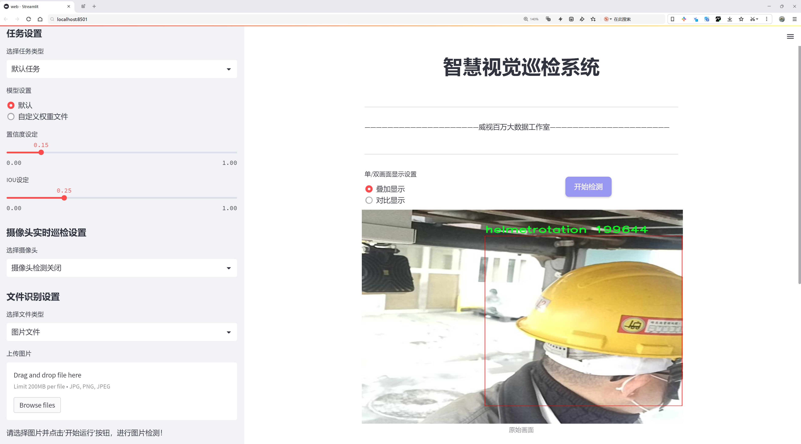

# 叉车工人安全帽佩戴检测检测系统源码分享
 # [一条龙教学YOLOV8标注好的数据集一键训练_70+全套改进创新点发刊_Web前端展示]

### 1.研究背景与意义

项目参考[AAAI Association for the Advancement of Artificial Intelligence](https://gitee.com/qunshansj/projects)

项目来源[AACV Association for the Advancement of Computer Vision](https://gitee.com/qunmasj/projects)

研究背景与意义

随着工业化进程的加快，叉车作为一种重要的工业运输工具，广泛应用于各类仓储和物流场所。然而，叉车作业环境复杂，工人面临的安全风险也随之增加。根据相关统计数据，叉车事故的发生率在工业事故中占据了相当大的比例，其中由于未佩戴安全帽而导致的伤害尤为突出。因此，建立一个有效的叉车工人安全帽佩戴检测系统，不仅可以提高工人的安全意识，还能有效降低事故发生率，保障工人的生命安全和健康。

在这一背景下，计算机视觉技术的迅猛发展为安全帽佩戴检测提供了新的解决方案。YOLO（You Only Look Once）系列模型因其高效的实时目标检测能力，逐渐成为各类视觉检测任务的首选。YOLOv8作为该系列的最新版本，具备更高的检测精度和更快的处理速度，适合在复杂的工业环境中应用。然而，标准的YOLOv8模型在特定场景下的表现仍然存在一定的局限性，尤其是在多种复杂背景和光照条件下的目标检测。因此，针对叉车工人安全帽佩戴的特定需求，对YOLOv8进行改进和优化显得尤为重要。

本研究将围绕改进YOLOv8模型，构建一个专门针对叉车工人安全帽佩戴检测的系统。为此，我们使用了一个包含1800张图像的数据集，该数据集涵盖了四个主要类别：cellphonerotation（使用手机）、facerotation（面部朝向）、helmetrotation（安全帽朝向）和personrotation（人员朝向）。这些类别的设计不仅考虑到了工人在工作中可能出现的各种姿态和行为，还充分反映了实际工作环境中的复杂性。通过对这些类别的深入分析和数据标注，我们能够为模型的训练提供丰富的样本，从而提高其在实际应用中的准确性和鲁棒性。

改进后的YOLOv8模型将结合深度学习技术，利用卷积神经网络（CNN）对工人佩戴安全帽的状态进行实时检测和识别。通过对图像特征的提取和分析，系统能够在多种工作场景下快速判断工人是否佩戴安全帽，并及时发出警报，提醒工人注意安全。这一系统的实现，不仅可以提升叉车作业的安全性，还能为企业的安全管理提供数据支持，帮助企业建立更加科学和系统的安全管理机制。

总之，基于改进YOLOv8的叉车工人安全帽佩戴检测系统的研究，具有重要的理论价值和实际意义。它不仅为计算机视觉技术在工业安全领域的应用提供了新的思路，也为提升工人安全意识、减少事故发生率做出了积极贡献。通过这一研究，我们期望能够推动叉车作业安全管理的智能化进程，为建设安全、高效的工业环境贡献力量。

### 2.图片演示




##### 注意：由于此博客编辑较早，上面“2.图片演示”和“3.视频演示”展示的系统图片或者视频可能为老版本，新版本在老版本的基础上升级如下：（实际效果以升级的新版本为准）

  （1）适配了YOLOV8的“目标检测”模型和“实例分割”模型，通过加载相应的权重（.pt）文件即可自适应加载模型。

  （2）支持“图片识别”、“视频识别”、“摄像头实时识别”三种识别模式。

  （3）支持“图片识别”、“视频识别”、“摄像头实时识别”三种识别结果保存导出，解决手动导出（容易卡顿出现爆内存）存在的问题，识别完自动保存结果并导出到tempDir中。

  （4）支持Web前端系统中的标题、背景图等自定义修改，后面提供修改教程。

  另外本项目提供训练的数据集和训练教程,暂不提供权重文件（best.pt）,需要您按照教程进行训练后实现图片演示和Web前端界面演示的效果。

### 3.视频演示

[3.1 视频演示](https://www.bilibili.com/video/BV1YMtieHEfa/)

### 4.数据集信息展示

##### 4.1 本项目数据集详细数据（类别数＆类别名）

nc: 4
names: ['cellphonerotation', 'facerotation', 'helmetrotation', 'personrotation']


##### 4.2 本项目数据集信息介绍

数据集信息展示

在当前的工业环境中，安全帽的佩戴是确保工人安全的重要措施之一。为了提升叉车工人佩戴安全帽的检测效率，研究团队构建了一个名为“helmet”的数据集，以支持改进YOLOv8模型在这一特定任务上的表现。该数据集专注于叉车工人及其周围环境中安全帽佩戴的监测，旨在通过深度学习技术提高安全管理的智能化水平。

“helmet”数据集包含四个主要类别，分别为“cellphonerotation”、“facerotation”、“helmetrotation”和“personrotation”。这些类别的设定不仅考虑到了工人在工作环境中可能出现的各种情况，还反映了对安全帽佩戴状态的多维度分析。

首先，“cellphonerotation”类别关注的是工人在操作叉车时使用手机的情境。这一类别的引入是基于对工人行为的观察，发现许多工人在工作时可能会分心，导致安全隐患。因此，该类别的数据样本主要包括工人在使用手机时的各种姿态，尤其是在佩戴安全帽的情况下，旨在训练模型识别出工人是否因使用手机而未能正确佩戴安全帽。

其次，“facerotation”类别则聚焦于工人面部朝向的变化。这一类别的数据样本涵盖了工人在工作中可能出现的各种面部朝向，包括侧面、正面和背面等。通过分析工人面部的朝向，模型能够更好地判断安全帽的佩戴情况，确保工人在操作叉车时始终保持安全帽的正确佩戴状态。

第三个类别“helmetrotation”专注于安全帽本身的旋转和位置变化。安全帽的佩戴状态不仅与工人的行为有关，还与安全帽的实际位置密切相关。该类别的数据样本记录了安全帽在不同情况下的旋转状态，帮助模型学习如何判断安全帽是否稳固地佩戴在工人头上。

最后，“personrotation”类别则是对工人整体姿态的监测。该类别的数据样本包括工人在叉车操作过程中的各种姿态变化，旨在捕捉工人在工作中可能出现的各种不安全行为。通过对工人姿态的全面分析，模型能够更准确地识别出潜在的安全隐患，从而及时发出警报，确保工人的安全。

综上所述，“helmet”数据集通过细致的类别划分和丰富的数据样本，为改进YOLOv8模型提供了坚实的基础。该数据集不仅有助于提升模型在叉车工人安全帽佩戴检测中的准确性和鲁棒性，还为未来的安全管理系统提供了重要的数据支持。通过对工人行为的深入分析和对安全帽佩戴状态的精准监测，该数据集将为提升工业安全水平、减少事故发生率做出积极贡献。


### 5.全套项目环境部署视频教程（零基础手把手教学）

[5.1 环境部署教程链接（零基础手把手教学）](https://www.ixigua.com/7404473917358506534?logTag=c807d0cbc21c0ef59de5)


[5.2 安装Python虚拟环境创建和依赖库安装视频教程链接（零基础手把手教学）](https://www.ixigua.com/7404474678003106304?logTag=1f1041108cd1f708b01a)

### 6.手把手YOLOV8训练视频教程（零基础小白有手就能学会）

[6.1 手把手YOLOV8训练视频教程（零基础小白有手就能学会）](https://www.ixigua.com/7404477157818401292?logTag=d31a2dfd1983c9668658)

### 7.70+种全套YOLOV8创新点代码加载调参视频教程（一键加载写好的改进模型的配置文件）

[7.1 70+种全套YOLOV8创新点代码加载调参视频教程（一键加载写好的改进模型的配置文件）](https://www.ixigua.com/7404478314661806627?logTag=29066f8288e3f4eea3a4)

### 8.70+种全套YOLOV8创新点原理讲解（非科班也可以轻松写刊发刊，V10版本正在科研待更新）

由于篇幅限制，每个创新点的具体原理讲解就不一一展开，具体见下列网址中的创新点对应子项目的技术原理博客网址【Blog】：


[8.1 70+种全套YOLOV8创新点原理讲解链接](https://gitee.com/qunmasj/good)

### 9.系统功能展示（检测对象为举例，实际内容以本项目数据集为准）

图9.1.系统支持检测结果表格显示

  图9.2.系统支持置信度和IOU阈值手动调节

  图9.3.系统支持自定义加载权重文件best.pt(需要你通过步骤5中训练获得)

  图9.4.系统支持摄像头实时识别

  图9.5.系统支持图片识别

  图9.6.系统支持视频识别

  图9.7.系统支持识别结果文件自动保存

  图9.8.系统支持Excel导出检测结果数据


### 10.原始YOLOV8算法原理

原始YOLOv8算法原理

YOLO（You Only Look Once）系列算法自诞生以来，便以其独特的目标检测方法在计算机视觉领域占据了一席之地。YOLOv8作为该系列的最新版本，承载着前几代算法的创新与改进，展现出更高的检测精度和更快的处理速度。YOLOv8的核心思想是将目标检测任务转化为一个回归问题，通过一个单一的神经网络模型，实时预测目标的位置和类别。这一创新使得YOLO系列在目标检测的实时性和准确性上均表现出色。

YOLOv8的网络结构由四个主要部分组成：输入端、主干网络（backbone）、特征增强网络（neck）和检测头（head）。在输入端，YOLOv8引入了马赛克数据增强技术，这种方法通过将多张图像拼接在一起，增加了训练数据的多样性，从而提升了模型的泛化能力。此外，YOLOv8还采用了自适应锚框计算和自适应灰度填充技术，以便更好地适应不同场景下的目标检测需求。

主干网络是YOLOv8的特征提取核心，采用了CSP（Cross Stage Partial）结构和C2f模块。CSP结构通过将特征提取过程分为多个分支，增强了模型的特征表示能力，提升了梯度流动的效率。C2f模块则在YOLOv7的ELAN结构基础上进行了改进，进一步丰富了特征学习的过程。这种设计使得YOLOv8能够在不同尺度下有效提取目标特征，适应各种复杂场景。

特征增强网络采用了PAN-FPN（Path Aggregation Network - Feature Pyramid Network）结构，这一设计使得YOLOv8能够更好地融合不同尺度的特征，提升了对小目标的检测能力。PAN-FPN通过路径聚合的方式，将低层次的细节特征与高层次的语义特征进行结合，从而增强了模型对多尺度目标的适应性。这一特征融合策略在YOLOv8中起到了至关重要的作用，使得模型在处理复杂场景时能够保持高效的检测性能。

检测头部分是YOLOv8的创新之处，采用了解耦头结构，将目标分类和位置回归任务分开处理。这一设计使得每个任务可以更加专注于自身的目标，减少了在复杂场景下的定位不准和分类错误的问题。解耦头结构的引入，不仅提升了模型的性能，还使得损失函数的计算更加高效。YOLOv8在损失计算过程中采用了Task-Aligned Assigner策略，根据分类与回归的分数加权结果选择正样本，确保了训练过程的有效性。

与之前的YOLO版本相比，YOLOv8在检测方法上也进行了重要的创新，采用了Anchor-free目标检测方法。这种方法不再依赖于预先定义的锚点框，而是通过回归方式直接预测目标的位置和大小。这一改变极大地简化了模型的设计，减少了锚框预测的数量，加速了非最大抑制（NMS）过程，提高了模型的实时性和准确性。Anchor-free方法使得YOLOv8能够更灵活地适应不同形状和尺度的目标，进一步提升了目标检测的效果。

在YOLOv8的训练过程中，损失函数的设计也经过了精心调整。分类分支采用了二元交叉熵损失（Binary Cross Entropy Loss），而回归分支则结合了分布焦点损失（Distribution Focal Loss）和完全交并比损失（Complete Intersection over Union Loss），这两种损失函数的结合使得模型在边界框预测上更加精准，能够有效减少误检和漏检现象。

YOLOv8的轻量化设计也是其一大亮点。相较于前几代YOLO模型，YOLOv8在模型的权重文件上进行了进一步的压缩，使得其能够在各种嵌入式设备上高效运行。这一特性使得YOLOv8不仅适用于高性能计算环境，也能够在资源受限的设备上实现实时目标检测，满足了广泛应用场景的需求。

综上所述，YOLOv8作为YOLO系列的最新版本，通过一系列创新的设计和改进，提升了目标检测的精度和速度。其独特的网络结构、特征融合策略以及解耦头设计，使得YOLOv8在处理复杂场景时表现出色，能够满足实时检测的需求。随着YOLOv8的不断发展和应用，其在计算机视觉领域的影响力将进一步扩大，为目标检测技术的进步提供强有力的支持。


### 11.项目核心源码讲解（再也不用担心看不懂代码逻辑）

#### 11.1 ui.py

以下是经过简化和注释的核心代码部分：

```python
import sys
import subprocess
from QtFusion.path import abs_path

def run_script(script_path):
    """
    使用当前 Python 环境运行指定的脚本。

    Args:
        script_path (str): 要运行的脚本路径
    """
    # 获取当前 Python 解释器的路径
    python_path = sys.executable

    # 构建运行命令，使用 streamlit 运行指定的脚本
    command = f'"{python_path}" -m streamlit run "{script_path}"'

    # 执行命令，并检查是否成功
    result = subprocess.run(command, shell=True)
    if result.returncode != 0:
        print("脚本运行出错。")

# 主程序入口
if __name__ == "__main__":
    # 获取要运行的脚本的绝对路径
    script_path = abs_path("web.py")

    # 调用函数运行脚本
    run_script(script_path)
```

### 代码说明：
1. **导入模块**：
   - `sys`：用于获取当前 Python 解释器的路径。
   - `subprocess`：用于执行外部命令。
   - `abs_path`：从 `QtFusion.path` 模块导入，用于获取文件的绝对路径。

2. **`run_script` 函数**：
   - 接受一个参数 `script_path`，表示要运行的 Python 脚本的路径。
   - 使用 `sys.executable` 获取当前 Python 解释器的路径。
   - 构建命令字符串，使用 `streamlit` 运行指定的脚本。
   - 使用 `subprocess.run` 执行命令，并检查返回码，如果不为 0，则输出错误信息。

3. **主程序入口**：
   - 使用 `if __name__ == "__main__":` 确保只有在直接运行该脚本时才会执行以下代码。
   - 调用 `abs_path` 获取 `web.py` 的绝对路径。
   - 调用 `run_script` 函数运行指定的脚本。

这个程序文件名为 `ui.py`，其主要功能是运行一个指定的 Python 脚本，具体是通过 Streamlit 框架来启动一个 Web 应用。

首先，文件中导入了一些必要的模块，包括 `sys`、`os` 和 `subprocess`。`sys` 模块用于访问与 Python 解释器紧密相关的变量和函数，`os` 模块提供了与操作系统交互的功能，而 `subprocess` 模块则用于创建新进程、连接到它们的输入/输出/错误管道，并获取它们的返回码。

接下来，程序定义了一个名为 `run_script` 的函数，该函数接受一个参数 `script_path`，表示要运行的脚本的路径。在函数内部，首先获取当前 Python 解释器的路径，存储在 `python_path` 变量中。然后，构建一个命令字符串，使用 Streamlit 来运行指定的脚本。这个命令的格式是 `"{python_path}" -m streamlit run "{script_path}"`，其中 `-m` 表示以模块的方式运行 Streamlit。

随后，使用 `subprocess.run` 方法执行构建好的命令。如果命令执行的返回码不为 0，表示脚本运行出错，程序会打印出相应的错误信息。

在文件的最后部分，使用 `if __name__ == "__main__":` 语句来确保只有在直接运行该脚本时才会执行后面的代码。在这里，指定了要运行的脚本路径为 `web.py`，并调用 `run_script` 函数来执行这个脚本。

总体来说，这个文件的作用是为一个基于 Streamlit 的 Web 应用提供一个启动入口，通过命令行运行指定的 Python 脚本。

#### 11.2 code\ultralytics\data\build.py

以下是代码中最核心的部分，并附上详细的中文注释：

```python
import os
import random
import numpy as np
import torch
from torch.utils.data import dataloader, distributed
from .dataset import YOLODataset
from .utils import PIN_MEMORY

class InfiniteDataLoader(dataloader.DataLoader):
    """
    无限数据加载器，重复使用工作线程。

    该类继承自标准的 DataLoader，允许无限次迭代数据。
    """

    def __init__(self, *args, **kwargs):
        """初始化无限数据加载器，设置批次采样器为重复采样器。"""
        super().__init__(*args, **kwargs)
        object.__setattr__(self, "batch_sampler", _RepeatSampler(self.batch_sampler))
        self.iterator = super().__iter__()

    def __len__(self):
        """返回批次采样器的长度。"""
        return len(self.batch_sampler.sampler)

    def __iter__(self):
        """创建一个无限重复的迭代器。"""
        for _ in range(len(self)):
            yield next(self.iterator)

    def reset(self):
        """
        重置迭代器。

        当我们想在训练过程中修改数据集设置时，这个方法非常有用。
        """
        self.iterator = self._get_iterator()


class _RepeatSampler:
    """
    永久重复的采样器。

    参数:
        sampler (Dataset.sampler): 要重复的采样器。
    """

    def __init__(self, sampler):
        """初始化一个可以无限重复给定采样器的对象。"""
        self.sampler = sampler

    def __iter__(self):
        """迭代给定的采样器并生成其内容。"""
        while True:
            yield from iter(self.sampler)


def seed_worker(worker_id):
    """设置数据加载器工作线程的随机种子，以确保可重复性。"""
    worker_seed = torch.initial_seed() % 2**32  # 获取当前线程的随机种子
    np.random.seed(worker_seed)  # 设置 numpy 随机种子
    random.seed(worker_seed)  # 设置 random 随机种子


def build_yolo_dataset(cfg, img_path, batch, data, mode="train", rect=False, stride=32):
    """构建 YOLO 数据集。"""
    return YOLODataset(
        img_path=img_path,  # 图像路径
        imgsz=cfg.imgsz,  # 图像大小
        batch_size=batch,  # 批次大小
        augment=mode == "train",  # 是否进行数据增强
        hyp=cfg,  # 超参数配置
        rect=cfg.rect or rect,  # 是否使用矩形批次
        cache=cfg.cache or None,  # 是否缓存数据
        single_cls=cfg.single_cls or False,  # 是否单类检测
        stride=int(stride),  # 步幅
        pad=0.0 if mode == "train" else 0.5,  # 填充
        prefix=colorstr(f"{mode}: "),  # 前缀
        task=cfg.task,  # 任务类型
        classes=cfg.classes,  # 类别
        data=data,  # 数据配置
        fraction=cfg.fraction if mode == "train" else 1.0,  # 训练时的数据比例
    )


def build_dataloader(dataset, batch, workers, shuffle=True, rank=-1):
    """返回用于训练或验证集的 InfiniteDataLoader 或 DataLoader。"""
    batch = min(batch, len(dataset))  # 确保批次大小不超过数据集大小
    nd = torch.cuda.device_count()  # 获取 CUDA 设备数量
    nw = min([os.cpu_count() // max(nd, 1), workers])  # 计算工作线程数量
    sampler = None if rank == -1 else distributed.DistributedSampler(dataset, shuffle=shuffle)  # 分布式采样器
    generator = torch.Generator()  # 创建随机数生成器
    generator.manual_seed(6148914691236517205 + RANK)  # 设置随机种子
    return InfiniteDataLoader(
        dataset=dataset,  # 数据集
        batch_size=batch,  # 批次大小
        shuffle=shuffle and sampler is None,  # 是否打乱数据
        num_workers=nw,  # 工作线程数量
        sampler=sampler,  # 采样器
        pin_memory=PIN_MEMORY,  # 是否使用固定内存
        collate_fn=getattr(dataset, "collate_fn", None),  # 合并函数
        worker_init_fn=seed_worker,  # 工作线程初始化函数
        generator=generator,  # 随机数生成器
    )
```

### 代码说明：
1. **InfiniteDataLoader**：这是一个自定义的数据加载器，允许无限次迭代数据集，适用于需要不断重复训练数据的场景。
2. **_RepeatSampler**：这个类用于实现无限重复的采样器，确保在迭代过程中可以不断获取数据。
3. **seed_worker**：设置数据加载器工作线程的随机种子，以确保在多线程环境下的可重复性。
4. **build_yolo_dataset**：根据配置构建 YOLO 数据集，支持数据增强、缓存等功能。
5. **build_dataloader**：构建数据加载器，支持分布式训练，设置工作线程数量和批次大小等。

这个程序文件是用于构建和管理YOLO（You Only Look Once）模型的数据加载器，主要涉及到数据集的创建、数据加载以及数据源的检查等功能。程序中使用了PyTorch框架，结合了数据加载和处理的相关模块。

首先，文件导入了一些必要的库，包括操作系统、随机数生成、路径处理、NumPy、PyTorch、PIL图像处理库以及一些自定义的模块和类。接着，定义了一个名为`InfiniteDataLoader`的类，它继承自PyTorch的`DataLoader`，实现了一个可以无限循环使用工作线程的数据加载器。这个类的设计使得在训练过程中可以不断地从数据集中获取数据，而不需要重新初始化工作线程。

`InfiniteDataLoader`类的构造函数中，调用了父类的构造函数，并设置了一个自定义的批次采样器`_RepeatSampler`，这个采样器可以无限次地重复遍历给定的样本。类中还定义了`__len__`和`__iter__`方法，分别用于返回样本的长度和创建一个可以无限迭代的采样器。

`_RepeatSampler`类的功能是接收一个采样器并无限次地迭代它的内容，确保在训练过程中可以持续获取数据。

接下来，定义了一个`seed_worker`函数，用于设置数据加载器工作线程的随机种子，以确保在多线程环境下的随机性一致性。

`build_yolo_dataset`函数用于构建YOLO数据集，接收配置参数、图像路径、批次大小等信息，并返回一个`YOLODataset`对象。这个函数支持数据增强、单类检测、缓存等功能。

`build_dataloader`函数则用于返回一个`InfiniteDataLoader`或普通的`DataLoader`，根据传入的数据集、批次大小、工作线程数量等参数进行配置。它还会根据CUDA设备的数量和可用的CPU核心数来决定使用多少个工作线程，并在分布式训练时使用`DistributedSampler`。

`check_source`函数用于检查输入数据源的类型，支持多种输入格式，包括文件路径、URL、图像、视频流等。根据不同的输入类型，函数会返回相应的标志值，以便后续处理。

最后，`load_inference_source`函数用于加载推理源，接收输入源、图像大小、视频帧间隔等参数，并根据输入源的类型创建相应的数据集对象。这个函数会调用`check_source`来确定输入源的类型，并根据类型选择合适的加载器。

整体来看，这个程序文件的设计目的是为了方便YOLO模型在训练和推理阶段的数据管理，通过灵活的数据加载和处理机制，提高模型的训练效率和推理性能。

#### 11.3 70+种YOLOv8算法改进源码大全和调试加载训练教程（非必要）\ultralytics\nn\tasks.py

以下是经过简化并附有详细中文注释的核心代码部分：

```python
import torch
import torch.nn as nn

class BaseModel(nn.Module):
    """BaseModel类是Ultralytics YOLO系列模型的基类。"""

    def forward(self, x, *args, **kwargs):
        """
        模型的前向传播方法，处理单个尺度的输入。

        参数:
            x (torch.Tensor | dict): 输入图像张量或包含图像张量和真实标签的字典。

        返回:
            (torch.Tensor): 网络的输出。
        """
        if isinstance(x, dict):  # 处理训练和验证时的情况
            return self.loss(x, *args, **kwargs)  # 计算损失
        return self.predict(x, *args, **kwargs)  # 进行预测

    def predict(self, x, profile=False, visualize=False, augment=False):
        """
        通过网络执行前向传播。

        参数:
            x (torch.Tensor): 输入张量。
            profile (bool): 如果为True，打印每层的计算时间，默认为False。
            visualize (bool): 如果为True，保存模型的特征图，默认为False。
            augment (bool): 在预测时进行图像增强，默认为False。

        返回:
            (torch.Tensor): 模型的最后输出。
        """
        if augment:
            return self._predict_augment(x)  # 进行增强预测
        return self._predict_once(x, profile, visualize)  # 进行一次预测

    def _predict_once(self, x, profile=False, visualize=False):
        """
        执行一次前向传播。

        参数:
            x (torch.Tensor): 输入张量。
            profile (bool): 如果为True，打印每层的计算时间，默认为False。
            visualize (bool): 如果为True，保存模型的特征图，默认为False。

        返回:
            (torch.Tensor): 模型的最后输出。
        """
        y, dt = [], []  # 输出列表和时间列表
        for m in self.model:  # 遍历模型中的每一层
            if m.f != -1:  # 如果不是来自前一层
                x = y[m.f] if isinstance(m.f, int) else [x if j == -1 else y[j] for j in m.f]  # 从早期层获取输入
            if profile:
                self._profile_one_layer(m, x, dt)  # 记录当前层的计算时间
            x = m(x)  # 执行当前层的前向传播
            y.append(x if m.i in self.save else None)  # 保存输出
            if visualize:
                feature_visualization(x, m.type, m.i, save_dir=visualize)  # 可视化特征图
        return x  # 返回最后的输出

    def loss(self, batch, preds=None):
        """
        计算损失。

        参数:
            batch (dict): 用于计算损失的批次数据。
            preds (torch.Tensor | List[torch.Tensor]): 预测结果。

        返回:
            (torch.Tensor): 计算得到的损失值。
        """
        if not hasattr(self, 'criterion'):
            self.criterion = self.init_criterion()  # 初始化损失函数

        preds = self.forward(batch['img']) if preds is None else preds  # 获取预测结果
        return self.criterion(preds, batch)  # 计算损失

    def init_criterion(self):
        """初始化BaseModel的损失标准。"""
        raise NotImplementedError('compute_loss() needs to be implemented by task heads')

class DetectionModel(BaseModel):
    """YOLOv8检测模型。"""

    def __init__(self, cfg='yolov8n.yaml', ch=3, nc=None, verbose=True):
        """初始化YOLOv8检测模型。"""
        super().__init__()
        self.yaml = cfg if isinstance(cfg, dict) else yaml_model_load(cfg)  # 加载配置文件

        # 定义模型
        ch = self.yaml['ch'] = self.yaml.get('ch', ch)  # 输入通道
        if nc and nc != self.yaml['nc']:
            self.yaml['nc'] = nc  # 覆盖类别数
        self.model, self.save = parse_model(deepcopy(self.yaml), ch=ch, verbose=verbose)  # 解析模型
        self.names = {i: f'{i}' for i in range(self.yaml['nc'])}  # 默认名称字典

        # 初始化权重
        initialize_weights(self)

    def init_criterion(self):
        """初始化检测模型的损失标准。"""
        return v8DetectionLoss(self)  # 返回YOLOv8检测损失

# 其他模型类（SegmentationModel, PoseModel, ClassificationModel等）可以类似地进行定义
```

### 代码说明
1. **BaseModel类**：这是所有YOLO模型的基类，包含了前向传播、损失计算等基本功能。
2. **forward方法**：处理输入并决定是计算损失还是进行预测。
3. **predict方法**：执行前向传播，支持增强和可视化。
4. **loss方法**：计算模型的损失。
5. **DetectionModel类**：继承自BaseModel，专门用于YOLOv8的检测任务，初始化时加载配置并解析模型结构。

通过这些核心部分的简化和注释，可以更好地理解YOLO模型的结构和功能。

这个程序文件是YOLOv8算法的核心部分，主要定义了各种模型的基础类和具体实现，包括检测、分割、姿态估计和分类模型。文件中包含多个类和函数，主要用于构建和训练YOLOv8模型。

首先，文件导入了一些必要的库和模块，包括PyTorch、Ultralytics的自定义模块等。接着，定义了一个基类`BaseModel`，它是所有YOLOv8模型的基础。该类实现了模型的前向传播、预测、损失计算等基本功能。具体来说，`forward`方法处理输入数据并调用`predict`方法进行预测；`predict`方法执行一次前向传播，支持多种参数如时间分析和可视化；`loss`方法计算模型的损失。

在`BaseModel`类中，还定义了一些辅助方法，如`fuse`用于融合卷积层和批归一化层以提高计算效率，`load`用于加载预训练权重，`info`用于打印模型信息等。

接下来，文件中定义了多个具体模型类，如`DetectionModel`、`SegmentationModel`、`PoseModel`和`ClassificationModel`，它们都继承自`BaseModel`。每个模型类在初始化时会根据配置文件（YAML格式）加载相应的模型结构和参数，并定义特定的损失函数。例如，`DetectionModel`类实现了YOLOv8的目标检测功能，`SegmentationModel`实现了图像分割功能，`PoseModel`实现了姿态估计功能，而`ClassificationModel`则用于图像分类。

在每个模型类中，`init_criterion`方法用于初始化损失函数，这些损失函数是根据模型的类型而不同的。`_predict_augment`方法用于处理数据增强的预测，增强可以提高模型的鲁棒性。

此外，文件还定义了一个`Ensemble`类，用于将多个模型的输出进行集成，通常用于提高模型的预测性能。

最后，文件中还包含了一些辅助函数，如`torch_safe_load`用于安全加载模型权重，`attempt_load_weights`和`attempt_load_one_weight`用于加载单个或多个模型的权重，`parse_model`用于解析模型的配置文件并构建相应的PyTorch模型。

整体而言，这个文件是YOLOv8模型的实现核心，涵盖了模型的定义、训练、预测和损失计算等功能，为使用YOLOv8进行目标检测、分割、姿态估计和分类提供了基础。

#### 11.4 code\ultralytics\models\yolo\detect\val.py

以下是经过简化和注释的核心代码部分：

```python
import os
import torch
from ultralytics.engine.validator import BaseValidator
from ultralytics.utils.metrics import ConfusionMatrix, DetMetrics, box_iou
from ultralytics.utils.plotting import output_to_target, plot_images

class DetectionValidator(BaseValidator):
    """
    扩展自BaseValidator类的检测模型验证器。
    """

    def __init__(self, dataloader=None, save_dir=None, args=None):
        """初始化检测模型所需的变量和设置。"""
        super().__init__(dataloader, save_dir, args)
        self.metrics = DetMetrics(save_dir=self.save_dir)  # 初始化检测指标
        self.iouv = torch.linspace(0.5, 0.95, 10)  # IoU向量，用于计算mAP

    def preprocess(self, batch):
        """对YOLO训练的图像批次进行预处理。"""
        # 将图像转移到设备上并归一化
        batch["img"] = batch["img"].to(self.device, non_blocking=True) / 255
        for k in ["batch_idx", "cls", "bboxes"]:
            batch[k] = batch[k].to(self.device)

        return batch

    def postprocess(self, preds):
        """对预测输出应用非极大值抑制（NMS）。"""
        return ops.non_max_suppression(
            preds,
            self.args.conf,
            self.args.iou,
            multi_label=True,
            max_det=self.args.max_det,
        )

    def update_metrics(self, preds, batch):
        """更新指标。"""
        for si, pred in enumerate(preds):
            npr = len(pred)  # 当前预测的数量
            pbatch = self._prepare_batch(si, batch)  # 准备当前批次的数据
            cls, bbox = pbatch.pop("cls"), pbatch.pop("bbox")  # 获取真实标签

            if npr == 0:
                continue  # 如果没有预测，跳过

            predn = self._prepare_pred(pred, pbatch)  # 准备预测数据
            stat = {
                "conf": predn[:, 4],  # 置信度
                "pred_cls": predn[:, 5],  # 预测类别
                "tp": self._process_batch(predn, bbox, cls)  # 计算真阳性
            }
            self.stats["tp"].append(stat["tp"])  # 更新统计信息

    def get_stats(self):
        """返回指标统计信息和结果字典。"""
        stats = {k: torch.cat(v, 0).cpu().numpy() for k, v in self.stats.items()}  # 转换为numpy
        if len(stats) and stats["tp"].any():
            self.metrics.process(**stats)  # 处理指标
        return self.metrics.results_dict  # 返回结果字典

    def plot_predictions(self, batch, preds, ni):
        """在输入图像上绘制预测的边界框并保存结果。"""
        plot_images(
            batch["img"],
            *output_to_target(preds, max_det=self.args.max_det),
            paths=batch["im_file"],
            fname=self.save_dir / f"val_batch{ni}_pred.jpg",
            names=self.names,
        )

    def _process_batch(self, detections, gt_bboxes, gt_cls):
        """
        返回正确的预测矩阵。

        参数:
            detections (torch.Tensor): 预测结果的张量。
            gt_bboxes (torch.Tensor): 真实边界框的张量。
            gt_cls (torch.Tensor): 真实类别的张量。

        返回:
            (torch.Tensor): 正确的预测矩阵。
        """
        iou = box_iou(gt_bboxes, detections[:, :4])  # 计算IoU
        return self.match_predictions(detections[:, 5], gt_cls, iou)  # 匹配预测和真实标签
```

### 代码说明：
1. **DetectionValidator类**：这是一个用于YOLO模型验证的类，继承自`BaseValidator`。
2. **初始化方法**：设置了一些必要的变量和指标。
3. **预处理方法**：将输入图像归一化并转移到设备上，同时处理标签。
4. **后处理方法**：应用非极大值抑制（NMS）来过滤预测结果。
5. **更新指标方法**：计算并更新检测指标，如真阳性等。
6. **获取统计信息方法**：返回计算得到的指标结果。
7. **绘制预测结果方法**：将预测的边界框绘制在图像上并保存。
8. **处理批次方法**：计算IoU并匹配预测与真实标签，返回正确的预测矩阵。

这个程序文件 `val.py` 是 Ultralytics YOLO 模型的验证模块，主要用于在目标检测任务中评估模型的性能。文件中定义了一个名为 `DetectionValidator` 的类，该类继承自 `BaseValidator`，并实现了一系列用于验证的功能。

在初始化方法中，`DetectionValidator` 类接收数据加载器、保存目录、进度条、参数和回调等信息，并设置了一些必要的变量和指标。它定义了目标检测任务，并初始化了一些评估指标，如 `DetMetrics` 和混淆矩阵。

`preprocess` 方法用于对输入的图像批次进行预处理，包括将图像转换为适合模型输入的格式，并将标签和边界框移动到相应的设备上。如果设置了保存混合标签的选项，还会计算并保存自动标注的信息。

`init_metrics` 方法用于初始化评估指标，判断数据集是否为 COCO 格式，并根据模型的类别名称设置相关参数。

`postprocess` 方法应用非极大值抑制（NMS）来处理模型的预测输出，以减少重叠的边界框。

`_prepare_batch` 和 `_prepare_pred` 方法分别用于准备真实标签和模型预测的边界框，以便进行后续的评估。

`update_metrics` 方法负责更新评估指标，处理每个批次的预测结果，并将其与真实标签进行比较，计算出正确的预测。

`finalize_metrics` 方法用于设置最终的评估指标，包括速度和混淆矩阵。

`get_stats` 方法返回当前的评估统计信息，计算每个类别的目标数量，并返回结果字典。

`print_results` 方法用于打印每个类别的训练或验证集指标，包括总的检测数量和每个类别的平均精度。

`_process_batch` 方法用于计算每个检测的 IoU（交并比），并返回正确预测的矩阵。

`build_dataset` 和 `get_dataloader` 方法用于构建数据集和数据加载器，以便在验证过程中使用。

`plot_val_samples` 和 `plot_predictions` 方法用于可视化验证样本和模型的预测结果，并将其保存为图像文件。

`save_one_txt` 和 `pred_to_json` 方法分别用于将检测结果保存为文本文件和 COCO 格式的 JSON 文件，以便后续分析和评估。

`eval_json` 方法用于评估 YOLO 输出的 JSON 格式结果，并返回性能统计信息，支持与 COCO API 进行交互以计算 mAP（平均精度）。

整体来看，这个文件实现了 YOLO 模型在目标检测任务中的验证流程，包括数据预处理、模型预测、指标计算和结果保存等功能，为用户提供了一个完整的验证框架。

#### 11.5 train.py

以下是代码中最核心的部分，并附上详细的中文注释：

```python
class DetectionTrainer(BaseTrainer):
    """
    扩展自 BaseTrainer 类的检测模型训练类。
    用于训练 YOLO 检测模型。
    """

    def build_dataset(self, img_path, mode="train", batch=None):
        """
        构建 YOLO 数据集。

        参数:
            img_path (str): 包含图像的文件夹路径。
            mode (str): 模式，可以是 'train' 或 'val'，用户可以为每种模式自定义不同的数据增强。
            batch (int, optional): 批次大小，仅用于 'rect' 模式。默认为 None。
        """
        gs = max(int(de_parallel(self.model).stride.max() if self.model else 0), 32)
        return build_yolo_dataset(self.args, img_path, batch, self.data, mode=mode, rect=mode == "val", stride=gs)

    def get_dataloader(self, dataset_path, batch_size=16, rank=0, mode="train"):
        """构造并返回数据加载器。"""
        assert mode in ["train", "val"]  # 确保模式是 'train' 或 'val'
        with torch_distributed_zero_first(rank):  # 在分布式环境中，仅初始化一次数据集
            dataset = self.build_dataset(dataset_path, mode, batch_size)
        shuffle = mode == "train"  # 训练模式下打乱数据
        if getattr(dataset, "rect", False) and shuffle:
            LOGGER.warning("WARNING ⚠️ 'rect=True' 与 DataLoader shuffle 不兼容，设置 shuffle=False")
            shuffle = False
        workers = self.args.workers if mode == "train" else self.args.workers * 2  # 根据模式设置工作线程数
        return build_dataloader(dataset, batch_size, workers, shuffle, rank)  # 返回数据加载器

    def preprocess_batch(self, batch):
        """对一批图像进行预处理，包括缩放和转换为浮点数。"""
        batch["img"] = batch["img"].to(self.device, non_blocking=True).float() / 255  # 将图像转换为浮点数并归一化
        if self.args.multi_scale:  # 如果启用多尺度训练
            imgs = batch["img"]
            sz = (
                random.randrange(self.args.imgsz * 0.5, self.args.imgsz * 1.5 + self.stride)
                // self.stride
                * self.stride
            )  # 随机选择一个尺寸
            sf = sz / max(imgs.shape[2:])  # 计算缩放因子
            if sf != 1:
                ns = [
                    math.ceil(x * sf / self.stride) * self.stride for x in imgs.shape[2:]
                ]  # 计算新的形状
                imgs = nn.functional.interpolate(imgs, size=ns, mode="bilinear", align_corners=False)  # 进行插值
            batch["img"] = imgs  # 更新批次中的图像
        return batch

    def get_model(self, cfg=None, weights=None, verbose=True):
        """返回一个 YOLO 检测模型。"""
        model = DetectionModel(cfg, nc=self.data["nc"], verbose=verbose and RANK == -1)  # 创建检测模型
        if weights:
            model.load(weights)  # 加载权重
        return model

    def get_validator(self):
        """返回用于 YOLO 模型验证的 DetectionValidator。"""
        self.loss_names = "box_loss", "cls_loss", "dfl_loss"  # 定义损失名称
        return yolo.detect.DetectionValidator(
            self.test_loader, save_dir=self.save_dir, args=copy(self.args), _callbacks=self.callbacks
        )  # 返回验证器

    def plot_training_samples(self, batch, ni):
        """绘制带有注释的训练样本。"""
        plot_images(
            images=batch["img"],
            batch_idx=batch["batch_idx"],
            cls=batch["cls"].squeeze(-1),
            bboxes=batch["bboxes"],
            paths=batch["im_file"],
            fname=self.save_dir / f"train_batch{ni}.jpg",
            on_plot=self.on_plot,
        )  # 绘制图像并保存

    def plot_metrics(self):
        """从 CSV 文件中绘制指标。"""
        plot_results(file=self.csv, on_plot=self.on_plot)  # 保存结果图像
```

### 代码核心部分说明：
1. **DetectionTrainer 类**：这是一个用于训练 YOLO 检测模型的类，继承自 `BaseTrainer`。
2. **build_dataset 方法**：构建数据集，处理图像路径和数据增强。
3. **get_dataloader 方法**：构造数据加载器，确保在分布式环境中只初始化一次数据集。
4. **preprocess_batch 方法**：对输入的图像批次进行预处理，包括归一化和可能的多尺度调整。
5. **get_model 方法**：返回一个 YOLO 检测模型，并可选择加载预训练权重。
6. **get_validator 方法**：返回用于模型验证的对象。
7. **plot_training_samples 和 plot_metrics 方法**：用于可视化训练样本和训练指标，帮助监控训练过程。

这个程序文件 `train.py` 是一个用于训练 YOLO（You Only Look Once）目标检测模型的实现，继承自 `BaseTrainer` 类。程序中定义了一个 `DetectionTrainer` 类，专门用于处理与目标检测相关的训练任务。

在类的构造函数中，首先会调用父类的构造函数，初始化模型、数据集和其他参数。接着，程序提供了多个方法来构建数据集、获取数据加载器、预处理图像批次、设置模型属性、获取模型、获取验证器、记录损失、显示训练进度、绘制训练样本和绘制训练指标等。

`build_dataset` 方法用于构建 YOLO 数据集，接收图像路径、模式（训练或验证）和批次大小作为参数。根据模式的不同，可以为每种模式自定义不同的数据增强策略。`get_dataloader` 方法则构建并返回数据加载器，确保在分布式训练中只初始化一次数据集。

在 `preprocess_batch` 方法中，对输入的图像批次进行预处理，包括缩放和转换为浮点数格式。如果启用了多尺度训练，程序会随机选择一个图像大小并调整图像的尺寸，以适应模型的输入要求。

`set_model_attributes` 方法用于设置模型的属性，包括类别数量和类别名称等。`get_model` 方法返回一个 YOLO 检测模型，并可以选择加载预训练权重。

`get_validator` 方法返回一个用于模型验证的验证器，记录损失项并进行评估。`label_loss_items` 方法用于返回带有标签的训练损失字典，便于后续分析。

在训练过程中，`progress_string` 方法会返回一个格式化的字符串，显示当前的训练进度，包括当前的 epoch、GPU 内存使用情况、损失值、实例数量和图像大小等信息。

此外，程序还提供了绘制训练样本和绘制训练指标的功能，分别通过 `plot_training_samples` 和 `plot_metrics` 方法实现。这些方法利用 `plot_images` 和 `plot_results` 函数将训练过程中的样本和指标可视化，便于观察和分析模型的训练效果。

最后，`plot_training_labels` 方法用于创建一个带标签的训练图，展示训练数据集中所有的边界框和类别信息，进一步帮助理解模型的训练情况。整体来看，这个程序文件是一个功能全面的目标检测模型训练框架，适用于 YOLO 系列模型的训练和评估。

#### 11.6 70+种YOLOv8算法改进源码大全和调试加载训练教程（非必要）\ultralytics\models\sam\model.py

以下是代码中最核心的部分，并附上详细的中文注释：

```python
from pathlib import Path
from ultralytics.engine.model import Model
from .build import build_sam
from .predict import Predictor

class SAM(Model):
    """
    SAM（Segment Anything Model）接口类。

    SAM旨在实现可提示的实时图像分割。可以使用多种提示方式，如边界框、点或标签。该模型具有零-shot性能，并在SA-1B数据集上进行训练。
    """

    def __init__(self, model='sam_b.pt') -> None:
        """
        使用预训练模型文件初始化SAM模型。

        参数:
            model (str): 预训练SAM模型文件的路径。文件应具有.pt或.pth扩展名。

        异常:
            NotImplementedError: 如果模型文件扩展名不是.pt或.pth。
        """
        # 检查模型文件的扩展名是否为.pt或.pth
        if model and Path(model).suffix not in ('.pt', '.pth'):
            raise NotImplementedError('SAM预测需要预训练的*.pt或*.pth模型。')
        # 调用父类构造函数，初始化模型
        super().__init__(model=model, task='segment')

    def predict(self, source, stream=False, bboxes=None, points=None, labels=None, **kwargs):
        """
        对给定的图像或视频源执行分割预测。

        参数:
            source (str): 图像或视频文件的路径，或PIL.Image对象，或numpy.ndarray对象。
            stream (bool, optional): 如果为True，则启用实时流。默认为False。
            bboxes (list, optional): 用于提示分割的边界框坐标列表。默认为None。
            points (list, optional): 用于提示分割的点列表。默认为None。
            labels (list, optional): 用于提示分割的标签列表。默认为None。

        返回:
            (list): 模型的预测结果。
        """
        # 设置预测的默认参数
        overrides = dict(conf=0.25, task='segment', mode='predict', imgsz=1024)
        kwargs.update(overrides)  # 更新额外参数
        prompts = dict(bboxes=bboxes, points=points, labels=labels)  # 收集提示信息
        # 调用父类的预测方法
        return super().predict(source, stream, prompts=prompts, **kwargs)

    def info(self, detailed=False, verbose=True):
        """
        记录有关SAM模型的信息。

        参数:
            detailed (bool, optional): 如果为True，则显示有关模型的详细信息。默认为False。
            verbose (bool, optional): 如果为True，则在控制台上显示信息。默认为True。

        返回:
            (tuple): 包含模型信息的元组。
        """
        return model_info(self.model, detailed=detailed, verbose=verbose)

    @property
    def task_map(self):
        """
        提供从'segment'任务到其对应'预测器'的映射。

        返回:
            (dict): 将'segment'任务映射到其对应'预测器'的字典。
        """
        return {'segment': {'predictor': Predictor}}
```

### 代码核心部分说明：
1. **SAM类**：这是一个用于图像分割的模型接口，继承自`Model`类。
2. **初始化方法**：构造函数检查模型文件的扩展名，并调用父类的构造函数进行初始化。
3. **预测方法**：该方法用于对输入的图像或视频源进行分割预测，支持多种提示方式（边界框、点、标签）。
4. **信息方法**：用于获取模型的详细信息。
5. **任务映射属性**：提供从分割任务到相应预测器的映射，便于扩展和管理不同的任务。

这个程序文件是Ultralytics YOLO系列中的一个模块，专门用于实现Segment Anything Model（SAM），主要用于实时图像分割任务。SAM模型具有极高的灵活性，能够根据不同的提示进行分割，并且在SA-1B数据集上进行了训练。该模型的一个显著特点是具备零-shot性能，意味着它可以在没有先前知识的情况下，适应新的图像分布和任务。

在代码中，首先导入了一些必要的库和模块，包括Path类用于处理文件路径，Model类用于构建模型，以及一些工具函数。接着定义了一个名为SAM的类，该类继承自Model类，主要用于实现SAM模型的接口。

在SAM类的初始化方法中，接受一个模型文件的路径，确保该文件的扩展名为.pt或.pth。如果扩展名不符合要求，则抛出NotImplementedError异常。初始化完成后，调用父类的构造函数，设置任务为“segment”。

_load方法用于加载指定的权重文件到SAM模型中。predict方法则是进行分割预测的核心功能，接受图像或视频源的路径，以及可选的边界框、点和标签作为提示。该方法会将一些默认参数与用户提供的参数合并，并调用父类的predict方法进行预测。

__call__方法是predict方法的别名，允许用户通过调用SAM实例直接进行预测。info方法用于记录和返回关于SAM模型的信息，可以选择是否显示详细信息和控制台输出。

最后，task_map属性提供了一个字典，将“segment”任务映射到其对应的预测器（Predictor），便于后续的任务处理。

总体而言，这个模块为图像分割任务提供了一个灵活且高效的接口，适合需要实时处理和适应不同输入的应用场景。

### 12.系统整体结构（节选）

### 整体功能和构架概括

该项目主要是基于YOLO（You Only Look Once）系列的目标检测和图像分割模型的实现，包含了模型的训练、验证、推理等多个模块。项目使用了Ultralytics的YOLOv8架构，提供了灵活的接口和功能，支持多种计算机视觉任务，包括目标检测、图像分割、姿态估计和分类等。

项目的整体结构可以分为以下几个部分：

1. **用户界面（UI）**：通过 `ui.py` 文件提供了一个简单的命令行界面，用于启动和运行模型。
2. **数据处理**：`build.py` 文件负责构建和管理数据集，提供数据加载和预处理功能。
3. **模型定义**：`tasks.py` 文件定义了不同类型的模型（检测、分割等），并实现了训练和评估的基础功能。
4. **验证和评估**：`val.py` 文件用于模型的验证，计算性能指标，并生成可视化结果。
5. **训练流程**：`train.py` 文件实现了模型的训练流程，包括数据加载、损失计算和模型更新等。
6. **图像分割**：`model.py` 和其他相关文件实现了图像分割模型的功能，支持多种输入和提示方式。
7. **推理和预测**：多个文件实现了模型的推理和预测功能，支持实时图像处理和结果输出。

### 文件功能整理表

| 文件路径                                                                                         | 功能描述                                                         |
|--------------------------------------------------------------------------------------------------|------------------------------------------------------------------|
| `D:\tools\20240809\code\ui.py`                                                                  | 提供命令行界面，启动和运行YOLO模型的Web应用。                   |
| `D:\tools\20240809\code\code\ultralytics\data\build.py`                                        | 构建和管理YOLO数据集，提供数据加载和预处理功能。                |
| `D:\tools\20240809\code\70+种YOLOv8算法改进源码大全和调试加载训练教程（非必要）\ultralytics\nn\tasks.py` | 定义YOLOv8模型的基础类和具体实现，处理训练和评估功能。          |
| `D:\tools\20240809\code\code\ultralytics\models\yolo\detect\val.py`                           | 实现目标检测模型的验证功能，计算性能指标并生成可视化结果。      |
| `D:\tools\20240809\code\train.py`                                                               | 实现YOLO模型的训练流程，包括数据加载、损失计算和模型更新。      |
| `D:\tools\20240809\code\70+种YOLOv8算法改进源码大全和调试加载训练教程（非必要）\ultralytics\models\sam\model.py` | 实现Segment Anything Model（SAM），用于图像分割任务。            |
| `D:\tools\20240809\code\code\ultralytics\models\yolo\segment\val.py`                          | 实现YOLOv8分割模型的验证功能，计算分割性能指标。                |
| `D:\tools\20240809\code\code\ultralytics\solutions\__init__.py`                               | 初始化Ultralytics解决方案模块，提供统一的接口。                  |
| `D:\tools\20240809\code\code\ultralytics\trackers\utils\matching.py`                          | 实现目标匹配算法，支持多目标跟踪功能。                          |
| `D:\tools\20240809\code\70+种YOLOv8算法改进源码大全和调试加载训练教程（非必要）\ultralytics\models\sam\predict.py` | 实现SAM模型的推理功能，支持实时图像分割。                        |
| `D:\tools\20240809\code\code\ultralytics\models\yolo\classify\val.py`                        | 实现YOLOv8分类模型的验证功能，计算分类性能指标。                |
| `D:\tools\20240809\code\code\ultralytics\models\yolo\segment\predict.py`                     | 实现YOLOv8分割模型的推理功能，支持实时图像分割。                |
| `D:\tools\20240809\code\70+种YOLOv8算法改进源码大全和调试加载训练教程（非必要）\ultralytics\models\sam\modules\decoders.py` | 实现SAM模型的解码器功能，处理模型输出。                          |

这个表格概述了每个文件的主要功能，展示了项目的模块化结构和各个部分之间的关系。

注意：由于此博客编辑较早，上面“11.项目核心源码讲解（再也不用担心看不懂代码逻辑）”中部分代码可能会优化升级，仅供参考学习，完整“训练源码”、“Web前端界面”和“70+种创新点源码”以“13.完整训练+Web前端界面+70+种创新点源码、数据集获取”的内容为准。

### 13.完整训练+Web前端界面+70+种创新点源码、数据集获取


# [下载链接：https://mbd.pub/o/bread/ZpuWl5lp](https://mbd.pub/o/bread/ZpuWl5lp)